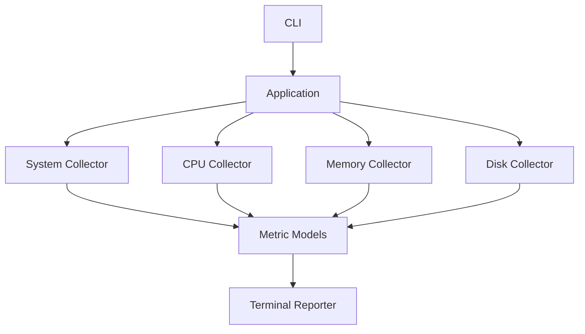

# WatchServer

**Lightweight Linux server monitoring CLI built with Python.**

WatchServer is a command-line tool that collects and displays essential Linux system metrics such as **CPU usage, memory usage, disk usage, system information, and uptime**.

It is a hands-on project focused on learning how **Python interacts with Linux systems** and how system metrics can be collected, processed, and presented through a CLI.

---

## Features

### System Information

* Hostname
* Operating system
* Kernel version
* Architecture
* Python version
* Boot time
* System uptime

### CPU Monitoring

* Overall CPU usage
* Physical CPU cores
* Logical CPU cores
* Per-core CPU usage
* Load average
* CPU frequency

### Memory Monitoring

* Total memory
* Used memory
* Available memory
* Memory usage percentage
* Swap memory
* Swap usage

### Disk Monitoring

* Total disk space
* Used space
* Free space
* Disk usage percentage
* Monitoring of selected filesystem paths

---

## Example Output

```text
============================================================
                       WATCH SERVER
                  PHASE 1 SERVER METRICS
============================================================

System
------------------------------------------------------------
Hostname        : ubuntu-server
OS              : Linux 6.8.0-31-generic
Kernel          : #31-Ubuntu SMP PREEMPT_DYNAMIC
Architecture    : x86_64
Python          : 3.11.8
Boot Time       : 2025-01-15T08:30:00+00:00
Uptime          : 2 days 4 hours 12 minutes

CPU
------------------------------------------------------------
Usage           : 37.4 %
Physical Cores  : 4
Logical Cores   : 8
Load Average    : 0.84 / 0.71 / 0.63
CPU Frequency   : 2400 MHz
Per-Core Usage  : 28.1% / 41.7% / 35.0% / 44.8% / 31.2% / 38.5% / 42.0% / 37.9%

Memory
------------------------------------------------------------
Total           : 7.8 GB
Used            : 4.1 GB
Available       : 3.7 GB
Usage           : 52.6 %
Swap Total      : 2.0 GB
Swap Used       : 0.0 B
Swap Usage      : 0.0 %

Disk
------------------------------------------------------------
Filesystem      : /
Total           : 30 GB
Used            : 18.2 GB
Free            : 11.8 GB
Usage           : 60.7 %

Phase Status
------------------------------------------------------------
Implemented     : System, CPU, memory, disk collection
Health Status   : Planned for Phase 3
Config File     : Planned for Phase 4

============================================================
```

> Values shown above are examples. Actual values depend on the system where WatchServer is running.

---

## Architecture

WatchServer follows a simple modular structure:



The main responsibilities are separated into:

```text
Collectors
    ↓
Collect system metrics

Models
    ↓
Represent collected data

Reporter
    ↓
Display metrics

CLI
    ↓
Handle user commands
```

This keeps the project easier to understand and maintain.

---

## Project Structure

```text
watchserver/
│
├── watchserver/
│   ├── __init__.py
│   ├── __main__.py
│   ├── app.py
│   │
│   ├── cli/
│   │   └── commands.py
│   │
│   ├── collectors/
│   │   ├── cpu.py
│   │   ├── disk.py
│   │   ├── memory.py
│   │   └── system.py
│   │
│   ├── models/
│   │   └── metrics.py
│   │
│   ├── reporters/
│   │   └── terminal.py
│   │
│   └── utils/
│       └── formatting.py
│
├── tests/
├── pyproject.toml
├── requirements.txt
├── README.md
└── LICENSE
```

---

## Tech Stack

| Technology   | Purpose                 |
| ------------ | ----------------------- |
| Python 3.11+ | Application development |
| psutil       | System metrics          |
| argparse     | CLI                     |
| dataclasses  | Metric models           |
| pathlib      | Filesystem handling     |
| Linux        | Target operating system |

---

## Installation

### Clone the repository

```bash
git clone https://github.com/abhishek62p/watchserver-monitoring-CLI.git

cd watchserver
```

### Create a virtual environment

```bash
python3 -m venv .venv
```

### Activate the environment

Linux/macOS:

```bash
source .venv/bin/activate
```

Windows PowerShell:

```powershell
.venv\Scripts\Activate.ps1
```

### Install dependencies

```bash
pip install -r requirements.txt
```

---

## Usage

### Complete server report

```bash
python -m watchserver
```

### System information

```bash
python -m watchserver system
```

### CPU information

```bash
python -m watchserver cpu
```

### Memory information

```bash
python -m watchserver memory
```

### Disk information

```bash
python -m watchserver disk
```

### Monitor specific filesystem paths

```bash
python -m watchserver \
    --disk-path / \
    --disk-path /var \
    disk
```

---

## License

This project is licensed under the **MIT License**.
